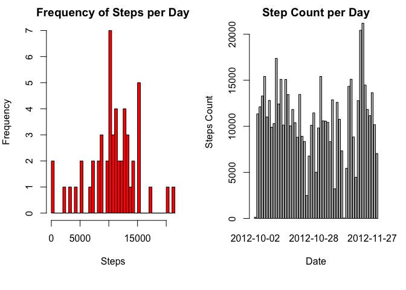
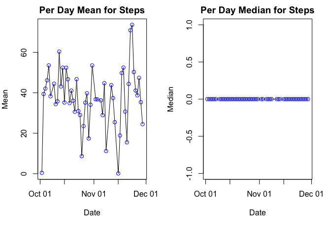
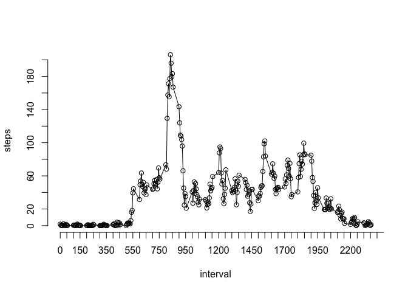
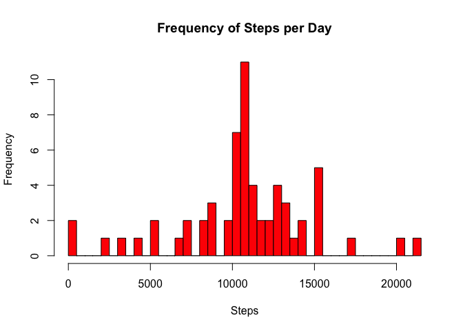
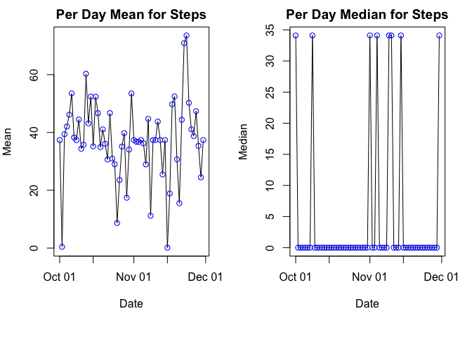
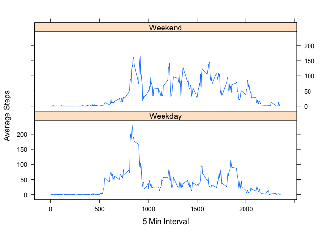

Assignment: Course Project 1
============================

This is R Markdown documentation for course Assignment.

Here we are loading the Activity data-set in R. We then process the data to create a new data-frame after removing the null "step" records;also we transform the "date" field to R Date data-type.


```r
act <- read.csv("/Users/Sandip/Documents/Data/Knowledge\ Base/Big\ Data/R\ Programming/Assignment_Data/activity.csv", header = TRUE, na.strings = "NA")
act_s <- act[!is.na(act$steps),]
act_s$date = as.Date(act_s$date)
summary(act_s)
```

```
##      steps             date               interval     
##  Min.   :  0.00   Min.   :2012-10-02   Min.   :   0.0  
##  1st Qu.:  0.00   1st Qu.:2012-10-16   1st Qu.: 588.8  
##  Median :  0.00   Median :2012-10-29   Median :1177.5  
##  Mean   : 37.38   Mean   :2012-10-30   Mean   :1177.5  
##  3rd Qu.: 12.00   3rd Qu.:2012-11-16   3rd Qu.:1766.2  
##  Max.   :806.00   Max.   :2012-11-29   Max.   :2355.0
```

We first Calculate the total number of steps taken per day and create histogram and bar-plot for the total number of steps taken each day


```r
# Calculate the count of steps per day
aggr <- aggregate(steps~date,act_s,sum)
par(mfrow = c(1,2), mar = c(6,4,2,2) )
hist(aggr$steps,xlab = "Steps", main = "Frequency of Steps per Day", col = "red",breaks = 53)
barplot(aggr$steps,names.arg = aggr$date, main = "Step Count per Day", xlab = "Date", ylab = "Steps Count")
```

<!-- -->


We calculate the Mean and Median of the total number of steps taken for each day and then plot the same using base plot.


```r
aggr_mean <- aggregate(steps~date,act_s,mean)
aggr_median <- aggregate(steps~date,act_s,median)
par(mfrow = c(1,2), mar = c(6,4,2,2) )
with(aggr_mean, plot (date,steps,type = "l",main = "Per Day Mean for Steps", xlab = "Date", ylab = "Mean"))
with(aggr_mean, points (date,steps,col = "blue"))
with(aggr_median, plot (date,steps,type = "l",main = "Per Day Median for Steps", xlab = "Date", ylab = "Median"))
with(aggr_median, points (date,steps,col = "Blue"))
```

<!-- -->

Here we create a time series plot of the 5-minute interval (x-axis) and the average number of steps taken, averaged across all days (y-axis)


```r
aggr_int_mean <- aggregate(steps~interval,act_s,mean)
with(aggr_int_mean, plot (interval,steps,type = "l",axes = FALSE))
with(aggr_int_mean, points (interval,steps))
axis(side = 1, at = seq(0,2500,50))
axis(side = 2, at = seq(0,210,20))
```

<!-- -->


Following 5-minute interval, on average across all the days in the dataset, contains the maximum number of steps:


```r
aggr_int_mean[aggr_int_mean$steps == max(aggr_int_mean$steps),1]
```

```
## [1] 835
```


We now calculate the total no. of missing values ("NA") in the data-set -

```r
sapply(act, function(x) sum(is.na(x)))
```

```
##    steps     date interval 
##     2304        0        0
```

Here we replace "NA"s will mean value for every 5 min interval; also we convert the date field to R Date data-type:


```r
x = aggregate(steps~interval,act,mean,na.rm = TRUE)

for (i in x$interval){
        act[(is.na(act$steps) & (act$interval == x$interval)),1] = x$steps
}
act$date = as.Date(act$date)
```

Inspecting the data-frame again to find if all the "NA"s are removed -


```r
sapply(act, function(x) sum(is.na(x)))
```

```
##    steps     date interval 
##        0        0        0
```

Here we plot the histogram for total number of steps per day

```r
aggr <- aggregate(steps~date,act,sum)
hist(aggr$steps,xlab = "Steps", main = "Frequency of Steps per Day", col = "red",breaks = 60)
```

<!-- -->

We calculate the Mean and Median of the total number of steps taken for each day and then plot the same using base plot.


```r
aggr_mean <- aggregate(steps~date,act,mean)
aggr_median <- aggregate(steps~date,act,median)
par(mfrow = c(1,2), mar = c(6,4,2,2) )
with(aggr_mean, plot (date,steps,type = "l",main = "Per Day Mean for Steps", xlab = "Date", ylab = "Mean"))
with(aggr_mean, points (date,steps,col = "blue"))
with(aggr_median, plot (date,steps,type = "l",main = "Per Day Median for Steps", xlab = "Date", ylab = "Median"))
with(aggr_median, points (date,steps,col = "Blue"))
```

<!-- -->
Here we find that, for the new data set the value of Median is greater than "0" for few days compared to all "0"s in the previous data-set.


We now add a new variable to the data-frame to indicate whether the date is a Weekday or Weekend

```r
act$Weekday = "Weekday"
act[weekdays(act$date) %in% c("Saturday", "Sunday"),4] = "Weekend"
aggr <- aggregate(steps~interval+Weekday,act,mean)
aggr$Weekday = as.factor(aggr$Weekday)
```

Here we plot Average Number of Steps per 5 min interval for all the days (grouped by Weekday indicator). We use Lattice plotting system here.


```r
library(lattice)
xyplot((aggr$steps)~aggr$interval|aggr$Weekday, type = "l", xlab = "5 Min Interval", ylab = "Average Steps", layout = c(1,2))
```

<!-- -->

